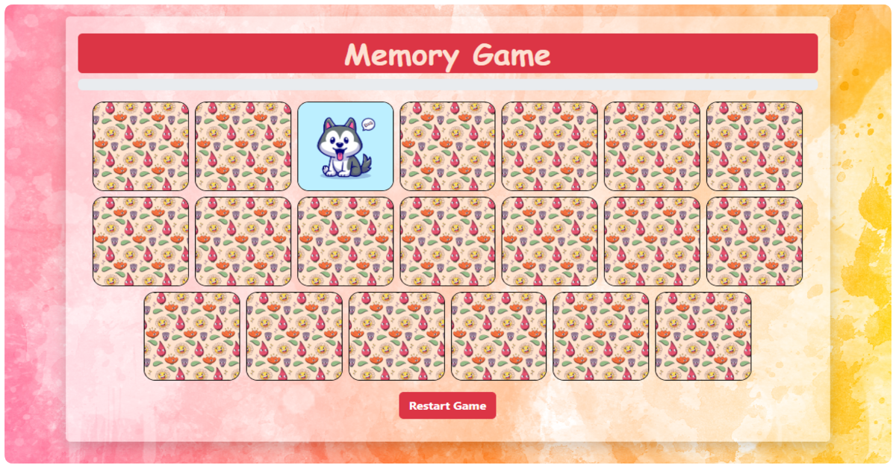
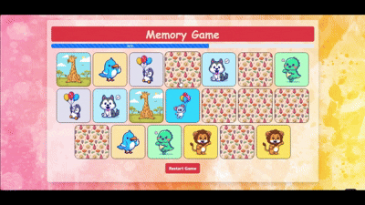
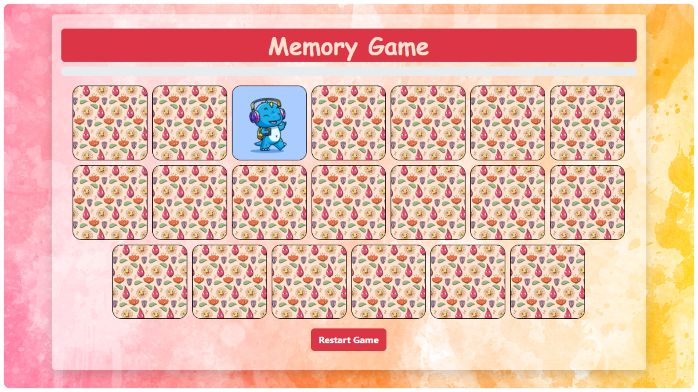
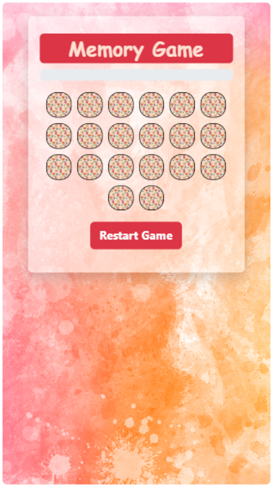
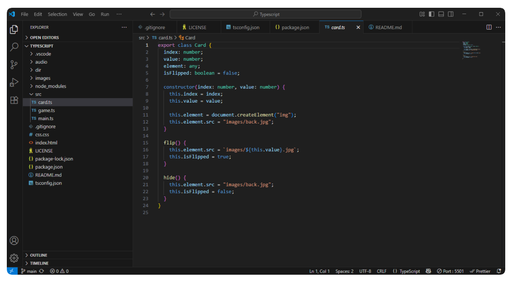

# 🎮 Memory Game (TypeScript + Bootstrap)



[](LICENSE)
[](https://MaryamMahmoudSayed.github.io/memory-game-ts)

🔗 **Live Demo:**
[Play the Memory Game](https://MaryamMahmoudSayed.github.io/memory-game-ts)

A simple **memory matching game** built using **TypeScript** and styled with **Bootstrap**.  
This project was created as part of my journey learning **UI/UX** and **Frontend Development**.

---

## 🧩 Features

- Flip and match cards
- Smooth animations and sound effects
- Tracks your score
- Responsive design
- Built with TypeScript for better structure and type safety

---

## 🛠️ Technologies Used

- TypeScript
- Bootstrap
- HTML5
- CSS3
- Audio & Images Assets

---

## 📁 Project Structure

memory-game/
├── src/ # TypeScript source files (.ts)
├── dir/ # Compiled JavaScript output (after build)
├── audio/ # Game sounds
├── images/ # Card images
├── index.html # Main HTML file
├── css.css # Custom CSS
├── package.json
├── tsconfig.json
├── README.md
└── LICENSE

---

## 📸 Screenshots

**Desktop View**


**Mobile View**


**Code Example**


---

## 🚀 Getting Started

### 1️⃣ Install dependencies

```bash
npm install
```

### 2️⃣ Build TypeScript files

```bash
npm run build
```

### 3️⃣ Run the game locally

Open index.html directly in your browser, or
Use VS Code Live Server, or
Run:

```bash
npm start
```

---

## 📜 License

This project is licensed under the **MIT License** — see the [LICENSE](LICENSE) file for details.

---

## 👩‍💻 Author

**Maryam Mahmoud**  
🎯 UI/UX & Frontend Developer in training  
🔗 [LinkedIn Profile](https://www.linkedin.com/in/maryam-mahmoud-005b7b163)
